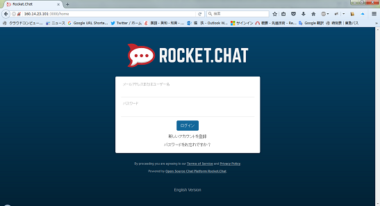
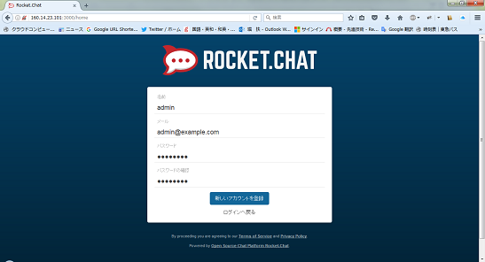
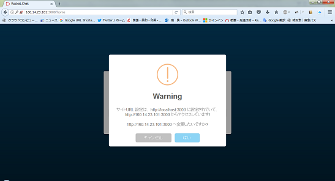
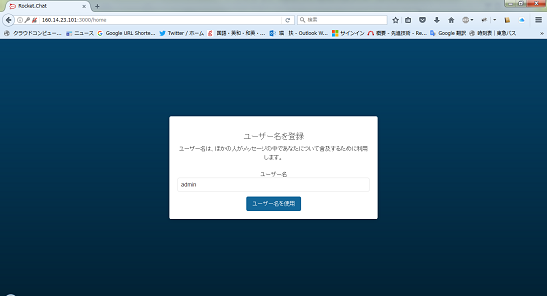
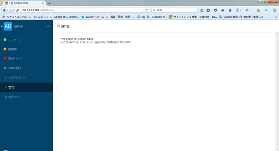
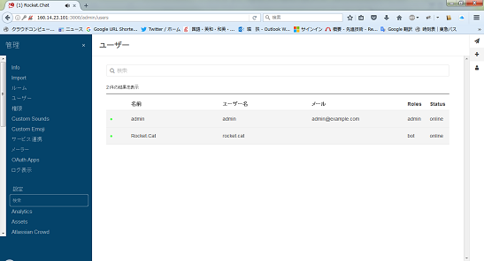
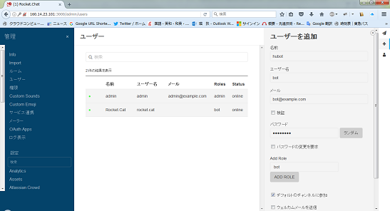
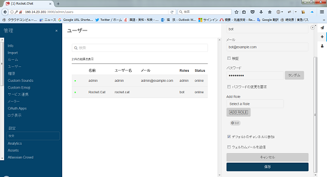
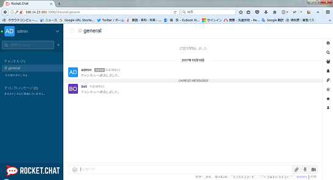

# Rocket.Chatサーバコンテナ、Hubotチャットボットコンテナを管理するdocker-compose.ymlファイル


Rocket.Chat は、SlackライクなチャットシステムをローカルLAN内で立ち上げることのできるOSSです。

Hubotは、チャットボットフレームワークのひとつで、Rocket.Chatをはじめとする幾つかのチャットシステムへのアダプタを備えているOSSです。

Dockerコンテナとして表題の機能をすべてエクサLAN内で立ち上げることができます。

------


# 使い方

## RocketChatの起動

0. Docker/Docker Composeが動作しているマシン上にログインする

1. 本リポジトリを適当なディレクトリ上で`git clone`する。
```
[you@hostname]$ git clone http://pandagit.exa-corp.co.jp/git/89004/gifhub.git
[you@hostname]$ cd gifhub/rocketchat_with_hubot
```
`git config --global http.proxy` にてプロクシ指定している場合、上記のcloneは失敗します。かならず指定を解除してから上記コマンドを実行してください。

2. 以下のコマンドを実行して RocketChat（とmongo）コンテナを起動する
```
[you@hostname]$ sudo docker-compose up -d rocketchat
```

## 管理アカウントとボット用アカウントの作成

1. ブラウザで http://＜Dockerサーバ＞:3000/ を開く

2. 「新しいアカウントを登録」を選択

  

3. 管理ユーザの名前、メールアドレス、パスワードを入力し、「新しいアカウントを登録」ボタンを押下

  

4. 以下の画面が出たら、「はい」ボタンを押下

  

5. 管理ユーザのユーザ名を入力し、「ユーザ名を使用」を押下

  


## ボット用ユーザの追加

1. 左上のユーザ名を選択してから、「管理」＞「ユーザ」を選択

  

2. 右上の「＋」を選択

  

3. ボットがログインするためのユーザ情報を登録し、「保存」ボタンを押す

  

  `docker-compose.yml`を編集しない場合は、以下の通りボットユーザ情報を入力する。

| **項目名** | **入力値** |
|:---------|:-----------|
| ユーザ名 | `bot` |
| メール | 適当 |
| パスワード | `password` |
| Add role | `bot` |
| デフォルトのチャンネルに追加 | する |
| ウェルカムメールを送信 | しない |

  

4. 管理画面を閉じる


  

## hubot コンテナの起動

1. 以下のコマンドを実行して、hubot コンテナを起動する
```
[you@hostname]$ sudo docker-compose up -d hubot
```

# 開発
`data/hubot` 以下にスクリプトファイルを配置してください。
ホットデプロイされない場合、hubotコンテナを再起動してください。
```
[you@hostname]$ cd data/hubot
[you@hostname]$ vi hogehoge.coffee
 ...スクリプトを編集

[you@hostname]$ cd ../../
[you@hostname]$ sudo docker-compose stop hubot
[you@hostname]$ sudo docker-compose start hubot
```

## ログ参照
```
# gifhub/rocketchat_with_hubot ディレクトリ上で実行

# 表示のみ
[you@hostname]$ sudo docker-compose logs hubot

# 最新を常に表示させる(Ctrl+Cで停止)
[you@hostname]$ sudo docker-compose logs -f hubot
```

## hubotコンテナ上にシェル接続
```
#  gifhub/rocketchat_with_hubot ディレクトリ上で実行
[you@hostname]$ sudo docker-compose exec hubot bash
[root@xxxxxxx]$ <- 変なコンピュータ名になったら成功


# 終了する場合はexit
[root@xxxxxxx]$ exit
[you@hostname]$
```


# その他管理コマンド

## 全停止
```
# gifhub/rocketchat_with_hubot ディレクトリ上で実行
[you@hostname]$ sudo docker-compose stop
```

## 全起動
```
# gifhub/rocketchat_with_hubot ディレクトリ上で実行
[you@hostname]$ sudo docker-compose up -d
```

## RocketChat上のすべての情報を消し初期化して起動し直す
```
# gifhub/rocketchat_with_hubot ディレクトリ上で実行
[you@hostname]$ sudo docker-compose stop rocketchat mongo
[you@hostname]$ cd data
[you@hostname]$ sudo rm -rf mongo && sudo -rm rocketchat && [you@hostname]$ mkdir mongo && mkdir rocketchat
[you@hostname]$ cd ..
[you@hostname]$ docker-compose up -d rocketchat
```

## hubotコンテナ上のすべての情報を消し初期化して起動し直す
```
# gifhub/rocketchat_with_hubot ディレクトリ上で実行
[you@hostname]$ docker-compose stop hubot
[you@hostname]$ cd data
[you@hostname]$ sudo rm -rf hubot && mkdir hubot
[you@hostname]$ cd ..
[you@hostname]$ docker-compose up -d hubot
```

## バックアップ
```
# gifhub/rocketchat_with_hubot ディレクトリ上で実行
[you@hostname]$ docker-compose stop
[you@hostname]$ cd ..
[you@hostname]$ tar cvfz backup.tar.gz ./rocketchat_with_hubot

# backup.tar.gz を保管する(略)
```

# 参考

## 外部リンク

* [Rocket.Chat 本家サイト(英語)](https://rocket.chat/)
* [Hubot 本家サイト(英語)](https://hubot.github.com/)
* [Docker 本家サイト(英語)](https://www.docker.com/)
* [アプリ屋もドカドカDockerを使おう](https://www.slideshare.net/HoriTasuku/docker-docker-54012849)

## 社内リンク

* [Hubot 本家サイト翻訳](http://lion.exa-corp.co.jp/redmine/projects/edge/wiki/Hubot)
* [Docker TI部サイト](http://www-end.exa-corp.co.jp/pukiwiki/index.php?Docker)
